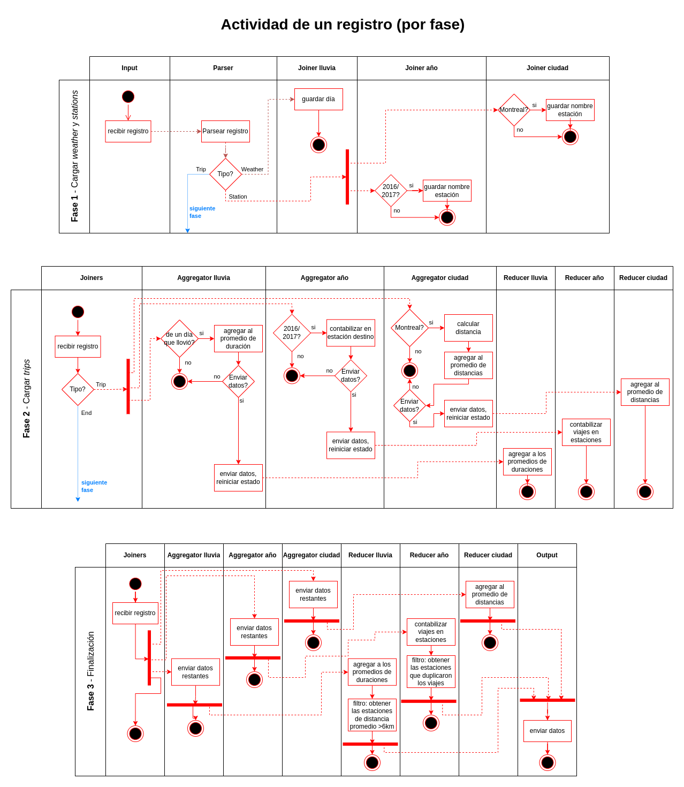
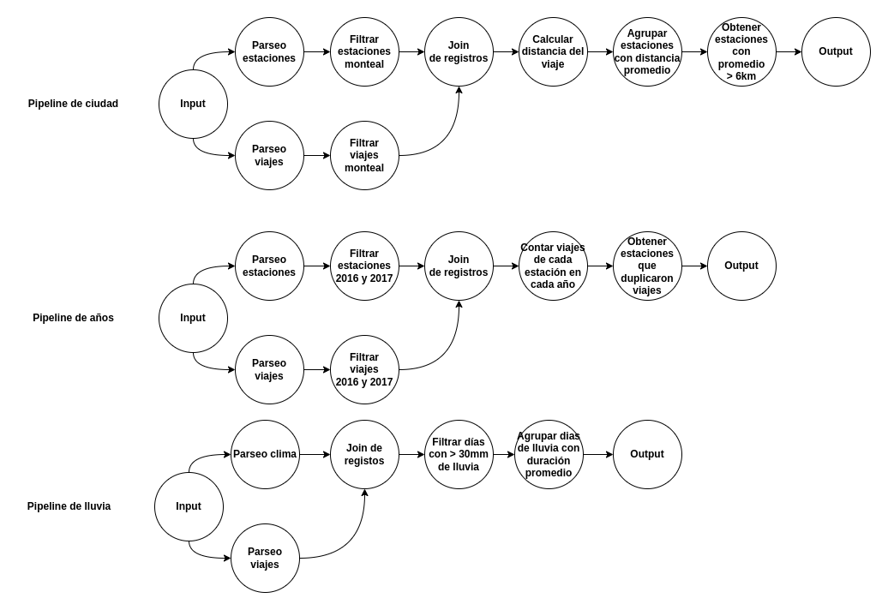

# TP Middleware y Coordinacion - Bike Rides Analyzer

## Scope

Se solicita un sistema distribuido que analice los registros de viajes realizados con bicicletas de la red pública provista por grandes ciudades.

Se requiere obtener:

1. La duración promedio de viajes que iniciaron en días con precipitaciones >30mm.

2. Los nombres de estaciones que al menos duplicaron la cantidad de viajes iniciados en ellas entre 2016 y el 2017.

3. Los nombres de estaciones de Montreal para la que el promedio de los ciclistas recorren más de 6km en llegar a ellas.

Dicha información se debe obtener de registros de clima, estaciones de bicicleta y viajes en bicicleta para las ciudades de Montreal, Toronto y Washington.

## Arquitectura

Para el sistema, se consideraron 5 unidades de desarrollo, cada una en una carpeta dentro del repositorio:

1. **input**: se conecta a el cliente. Es el punto de entrada de los registros de clima, estaciones y viajes que el sistema debe procesar.
2. **rain_trips**: procesa los viajes para los días que llovió (configurado a $\geq 30mm$ de lluvia). Inicialmente guarda los días que llovió y luego recibe los viajes. Solo procesa los viajes de los días que llovió, para los que va calculando la duración promedio del viaje por día.
3. **year_trips**: procesa los viajes dentro de años especificos (configurado a 2016 y 2017). Inicialmente guarda los nombres de las estaciones de esos años y luego recibe los viajes. Solo procesa los viajes de esos años, para los que va contando la cantidad de viajes por estación.
4. **city_trips**: procesa los viajes dentro de ciudades específicas (configurado a `montreal`). Inicialmente guarda los nombres de las estaciones de esas ciudades y luego recibe los viajes. Solo procesa los viajes de esa ciudad, para los que va calculando la distancia promedio que se recorre para llegar a cada estación.
5. **output**: sumidero de la información producida por las tres unidades anteriores. Consiste en 3 partes:

   - **Agrupador de rain_trips**: Va recibiendo la información de **rain_trips** y la va combinando.
   - **Agrupador de year_trips**: Va recibiendo la información de **year_trips** y la va combinando. Cuando finaliza la ejecución, filtra las estaciones calculando la relación $r$ entre la cantidad de viajes de los dos años, manteniendo los que $r \geq k$ (configurado $k=2$, es decir, duplicaron los viajes de un año al otro).
   - **Agrupador de city_trips**: Va recibiendo la información de **city_trips** y la va combinando. Cuando finaliza la ejecución, filtra las estaciones obteniendo aquellas cuyo promedio para llegar a ella es mayor a $d$ (configurado a $d=6$, manteniendo los de promedio $\geq 6km$).

   Cuando finaliza de agrupar toda la información, envía las estadísticas finales al cliente.

## Objetivos y restricciones de la arquitectura

- No es necesario considerar múltiples ejecuciones del procesamiento en una misma sesión del sistema.
- No se requiere tolerancia a fallas.
- El sistema debe estar optimizado para entornos multicomputadoras.
- El sistema debe soportar el incremento de los elementos de cómputo para escalar los volúmenes de información a procesa.
- Se debe proveer _graceful quit_ frente a señales `SIGTERM`.

## 4+1 vistas

Los diagramas de esta sección se encuentran disponibles para visualizar en [app.diagrams.net](https://app.diagrams.net/?mode=github#Hfdelu%2Fdistribuidos-tp1%2Fmain%2Finforme%2Fdiagramas%2Fdiagramas.xml). El archivo `.xml` utilizado se encuentra en [este repositorio](https://github.com/fdelu/distribuidos-tp1/blob/main/informe/diagramas/diagramas.xml).

### Escenarios

|  |
| :---------------------------------: |
|     _Diagrama de Casos de uso_      |

### Vista lógica

> TODO

### Vista de procesos

|  |
| :----------------------------: |
|   _Diagramas de Actividades_   |

|  |
| :--------------------: |
|   _Diagrama del DAG_   |

### Vista de desarrollo

> TODO

### Vista Física

|  |
| :---------------------------: |
|   _Diagrama de Despliegue_    |
