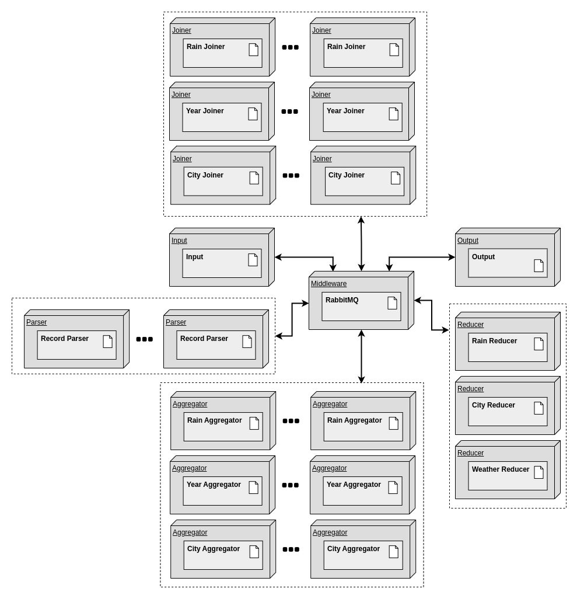

# TP Middleware y Coordinacion - Bike Rides Analyzer

## Scope

Se solicita un sistema distribuido que analice los registros de viajes realizados con bicicletas de la red pública provista por grandes ciudades.

Se requiere obtener:

1. La duración promedio de viajes que iniciaron en días con precipitaciones >30mm.

2. Los nombres de estaciones que al menos duplicaron la cantidad de viajes iniciados en ellas entre 2016 y el 2017.

3. Los nombres de estaciones de Montreal para la que el promedio de los ciclistas recorren más de 6km en llegar a ellas.

Dicha información se debe obtener de registros de clima, estaciones de bicicleta y viajes en bicicleta para las ciudades de Montreal, Toronto y Washington.

## Arquitectura

Para el sistema, se consideraron 5 unidades de desarrollo, cada una la carpeta `src/system`. Todas ellas se connectan por un middleware (RabbitMQ). Estas son:

1. **input**: se conecta a el cliente, utilizando ZeroMQ. Es el punto de entrada de los registros de clima, estaciones y viajes que el sistema debe procesar.
2. **parsers**: recibe mensajes del input, en batches csv como los que le envía el cliente. Parsea los registros de clima, estaciones y viajes, y los envía.
3. **joiners**: reciben los registros parseados y agregan información del clima y estaciones a cada viaje. También quitan alguna información irrelevante para esa pipeline. Hay 3 tipos de **joiners**:
   1. **rain_joiners**: Reciben todos los registros del clima y viajes. Agrega información de precipitaciones al viaje.
   2. **year_joiners**: Reciben los registros de las estaciones y viajes de 2016 y 2017. Agregan a cada viaje el nombre de la estación de inicio.
   3. **city_joiners**: Reciben los registros de las estaciones y viajes de una ciudad específica. Agregan a cada viaje el nombre de la estación de fin y las coordenadas de la estación de inicio y fin.
4. **aggregators**: reciben los viajes con información agregada y los unifican. Hay 3 tipos de **agregators**:
   1. **rain_aggregators**: Reciben los viajes con información de precipitaciones. Calculan la duración promedio de los viajes para cada día que llovió.
   2. **year_aggregators**: Reciben los viajes con información de la estación de inicio. Cuentan la cantidad de viajes por estación para cada año.
   3. **city_aggregators**: Reciben los viajes con información de la estación de fin y las coordenadas de la estación de inicio y fin. Calculan la distancia promedio que se recorre para llegar a cada estación.
5. **reducer**: recibe los registros unificados y los agrupan para obtener la estadística final. Hay 3 tipos de **reducer**:
   1. **rain_reducer**: Recibe los promedios de duración de viajes por día que llovió y los unifica.
   2. **year_reducer**: Recibe la cantidad de viajes por estación para cada año y los unifica. Una vez unificadas todas las cantidades, encuentra las estaciones que duplicaron la cantidad de viajes de un año al otro.
   3. **city_reducer**: Recibe la distancia promedio que se recorre para llegar a cada estación y los unifica. Una vez unificadas todas las distancias promedio, encuentra las estaciones que tienen un promedio mayor a 6km.
6. **output**: sumidero de la información producida los **reducer**. Se conecta al cliente utilizando ZeroMQ y le envía las estadísticas finales cuando llegan y el cliente se lo solicita.

## Objetivos y restricciones de la arquitectura

- No es necesario considerar múltiples ejecuciones del procesamiento en una misma sesión del sistema.
- No se requiere tolerancia a fallas.
- El sistema debe estar optimizado para entornos multicomputadoras.
- El sistema debe soportar el incremento de los elementos de cómputo para escalar los volúmenes de información a procesa.
- Se debe proveer _graceful quit_ frente a señales `SIGTERM`.

## 4+1 vistas

Los diagramas de esta sección se encuentran disponibles para visualizar en [app.diagrams.net](https://app.diagrams.net/?mode=github#Hfdelu%2Fdistribuidos-tp1%2Fmain%2Finforme%2Fdiagramas%2Fdiagramas.xml). El archivo `.xml` utilizado se encuentra en [este repositorio](https://github.com/fdelu/distribuidos-tp1/blob/main/informe/diagramas/diagramas.xml).

### Escenarios

|  |
| :---------------------------------: |
|     _Diagrama de Casos de uso_      |

### Vista lógica

> TODO

### Vista de procesos

|  |
| :----------------------------: |
|   _Diagramas de Actividades_   |

|  |
| :--------------------: |
|   _Diagrama del DAG_   |

### Vista de desarrollo

> TODO

### Vista Física

|  |
| :---------------------------: |
|   _Diagrama de Despliegue_    |

|  |
| :-------------------------: |
|   _Diagrama de Robustez_    |
